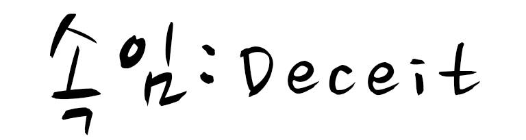

# Deceit
Deceit is based off a board game where players essentially attempt to deceive each other in their card predictions. We have created a deck of cards from over 100 paintings and art submissions to the Internet (i.e. Reddit) for players to draw from. Each turn, the host will select a phrase and card. Everyone else will also contribute a card. The cards are shuffled and then displayed for all to see. Everyone will place their votes as to which card belongs to the host. Every incorrect guess earns the host some points. On the other hand, correct guesses earn the guesser some points. The first to reach the threshold wins!

### Inspiration
We were inspired by the board game to make it available online for free for all to play. We hope to continue working on advancing the game mechanics and design to the extent where we can then host it online for all to enjoy.

## Winner of "Best FOSS Hack, BrickHack2 Spr2016"
